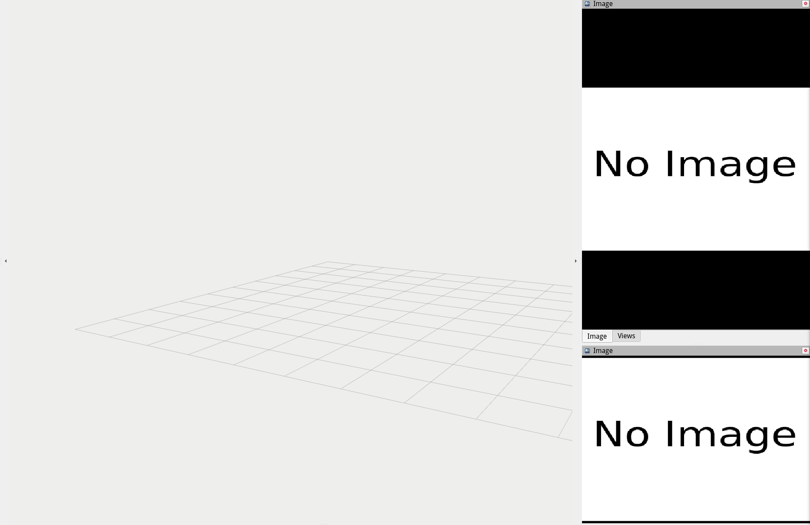

# FAST-Dynamic-Vision

**FAST-Dynamic-Vision** is a system for detection and tracking dynamic objects with event and depth sensing.

## 0. Overview

**FAST-Dynamic-Vision** is a detection and trajectory estimation algorithm based on event and depth camera.

**Related Paper**: [FAST-Dynamic-Vision: Detection and Tracking Dynamic Objects with Event and Depth Sensing](https://arxiv.org/abs/2103.05903), Botao He, Haojia Li, Siyuan Wu, Dong Wang, Zhiwei Zhang, Qianli Dong, Chao Xu, Fei Gao

**Video Links**: [YouTube](https://www.youtube.com/watch?v=QPpwppeE_x0&ab_channel=FeiGao), [Bilibili](https://www.bilibili.com/video/BV11U4y1p7EF/)


## 1. Dataset branch

This branch contains dataset you can use to test our code.

## 2. Setup

**Requirement**: ubuntu 18.04, or higher with ros-desktop-full installation; [**Ceres Solver**](http://ceres-solver.org/installation.html); OpenCV; [open_contrib](https://github.com/opencv/opencv_contrib)

**Step 1**: Installation

```
sudo apt install libeigen3-dev build-essential libopencv-contrib-dev
```

**Step 2**: Clone the thie repo
```
git clone https://github.com/ZJU-FAST-Lab/FAST-Dynamic-Vision.git --branch=main
```

**Step 3**: build this project
```
cd FAST-Dynamic-Vision
catkin_make
```

## 3. Run a simple demo

> Please clone branch `dataset` to use our demo data. We use [Git Large File Storage](https://git-lfs.github.com/) to store these demos. If you didn't install this, you can refer to [this](https://docs.github.com/en/repositories/working-with-files/managing-large-files/installing-git-large-file-storage) for more information.

```
git lfs clone https://github.com/ZJU-FAST-Lab/FAST-Dynamic-Vision.git --branch=dataset
```

### 3.1 Event-based motion compensation and object detection

This demo shows the performance of object detection algorithms.

```
source devel/setup.bash
roslaunch detector detection.launch
```

```
rosbag play ./dataset/event_detector/test_mavros_vins.bag
```



### 3.2 Moving ball trajectory estimation under motion-cap system

This demo shows detect and estimate the trajectory of a throwing ball utilizing event and depth camera. The ground truth of the ball trajectory is captured by Vicon Motion Capture system.

```
source devel/setup.bash
roslaunch bullet_traj_est demo_traj_est_rviz.launch
```

```
rosbag play ./dataset/traj_est/mocap_traj_est_demo_01.bag
```


## 4. Licence
The source code is released under [GPLv3](http://www.gnu.org/licenses/) license.

## 5. Maintaince

For any technical issues, please contact Haojia Li([hlied@connect.ust.hk](mailto:hlied@connect.ust.hk)), Botao He([botao.he@njit.edu.cn](mailto:botao.he@njit.edu.cn)), Siyuan Wu ([siyuanwu99@gmail.com](mailto:siyuanwu99@gmail.com)), or Fei GAO ([fgaoaa@zju.edu.cn](mailto:fgaoaa@zju.edu.cn)).

For commercial inquiries, please contact Fei GAO ([fgaoaa@zju.edu.cn](mailto:fgaoaa@zju.edu.cn)).
